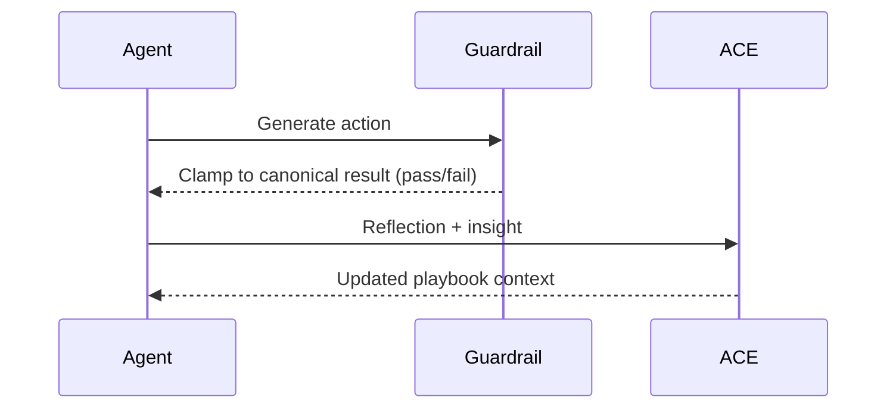

# Agent Learning via Early Experience (EE)

[](https://www.python.org/downloads/)
[](https://github.com/stanfordnlp/dspy)
[](LICENSE)

**Reward-free agents that learn from demonstrations, self-reflection, and deterministic guardrails.**

This repository combines Stanford/OSU’s *Early Experience* pipeline with Stanford’s *Agentic Context Engineering (ACE)* so an agent can:

- bootstrap from a small set of expert demonstrations,
- explore and critique its own rollouts,
- enforce hard guarantees with domain guardrails, and
- push lessons into an evolving ACE playbook for continuous improvement.

---

## 🧠 Architecture at a Glance

```mermaid
flowchart LR
    Demos[Expert Demos
    (JSONL)] --> EE[Early Experience Pipeline]
    EE --> WM[World Model]
    EE --> EXP[Exploration]
    EE --> REF[Reflection]
    EE --> POL[Policy]
    POL --> Decision
    Decision --> LiveLoop
    LiveLoop -->|Episodes| Guardrails
    Guardrails -->|Canonical
    Feedback| ACE
    ACE -->|Playbook Deltas| LiveLoop
```



---

## ⚙️ Quick Setup

```bash
git clone https://github.com/jmanhype/AgentLearningEE.git
cd AgentLearningEE

# Core + dev tooling
python -m pip install -e .[dev]

# Lightweight helpers for dataset sampling
python -m pip install datasets pillow numpy scikit-image
```

### Optional: ACE Playbook

```bash
git clone https://github.com/jmanhype/ace-playbook.git
python -m pip install -e ace-playbook

# Minimal env (adjust to taste)
export ACE_ENABLED=1
export ACE_DOMAIN_ID=swe-bench
export ACE_TARGET_STAGE=shadow
export DATABASE_URL=sqlite:///ace_playbook.db
export PYTHONPATH=$PWD/ace-playbook:$PYTHONPATH
python - <<'PY'
from sqlalchemy import create_engine
from ace.models.base import Base
engine = create_engine('sqlite:///ace_playbook.db')
Base.metadata.create_all(engine)
PY
```

### Language Model Credentials

The live loop auto-configures DSPy from `.env` or the shell. Any of the following works:

```bash
# OpenRouter (preferred)
export OPENROUTER_API_KEY=sk-or-v1-...

# or OpenAI
export OPENAI_API_KEY=sk-...

# or Anthropic
export ANTHROPIC_API_KEY=sk-ant-...
```

---

## 📦 Sample Datasets & Guardrails

We include 50-record benchmark slices for two domains. Run the snippets below once to generate them locally.

### SWE-bench (Developer)

```bash
python - <<'PY'
from datasets import load_dataset
from pathlib import Path
import json, itertools

DATA_DIR = Path('data/swe_bench_samples')
DATA_DIR.mkdir(parents=True, exist_ok=True)
OUTPUT = DATA_DIR / 'swe_bench_50.jsonl'

dataset = load_dataset('princeton-nlp/SWE-bench_Lite', split='dev', streaming=True)

records = []
for idx, record in enumerate(itertools.islice(dataset, 23), 1):
    issue = record.get('issue', {})
    task_id = f"swe-{record['repo'].replace('/', '_')}-{issue.get('number') or f'sample{idx}'}"
    patch = record.get('patch')

    records.append({
        "task_id": task_id,
        "state": {
            "repo": record['repo'],
            "base_commit": record['base_commit'],
            "issue": f"{issue.get('title', '')}\n\n{issue.get('body', '')}",
            "failing_tests": record.get('test_commands', []),
        },
        "action": {"patch": patch},
        "next_state": {"tests_pass": True},
        "ground_truth": "pass",
        "guardrail": {
            "instructions": "Apply the patch and ensure test_commands exit with code 0.",
            "value": "pass",
            "format": "string"
        }
    })

with OUTPUT.open('w', encoding='utf-8') as f:
    for rec in records:
        json.dump(rec, f)
        f.write('\n')

print(f'Wrote {len(records)} SWE-bench samples to {OUTPUT}')
PY
```

### MagicBrush (Artistry)

```bash
python - <<'PY'
from datasets import load_dataset
from pathlib import Path
import json, itertools, base64
from PIL import Image
import numpy as np
from io import BytesIO
from skimage.metrics import structural_similarity

DATA_DIR = Path('data/magicbrush_samples')
DATA_DIR.mkdir(parents=True, exist_ok=True)
OUTPUT = DATA_DIR / 'magicbrush_50.jsonl'

def to_image(blob):
    if isinstance(blob, dict) and 'bytes' in blob:
        return Image.open(BytesIO(blob['bytes'])).convert('RGB')
    raise ValueError('Unsupported image format')

def preprocess_pair(source, target):
    if target.size != source.size:
        target = target.resize(source.size, Image.LANCZOS)
    return source, target

def mse(img1, img2):
    arr1 = np.asarray(img1).astype('float32')
    arr2 = np.asarray(img2).astype('float32')
    return float(np.mean((arr1 - arr2) ** 2))

def ssim(img1, img2):
    arr1 = np.asarray(img1).astype('float32')
    arr2 = np.asarray(img2).astype('float32')
    return float(structural_similarity(arr1, arr2, channel_axis=2, data_range=255))

stream = load_dataset('osunlp/MagicBrush', split='dev', streaming=True)

with OUTPUT.open('w', encoding='utf-8') as f:
    for record in itertools.islice(stream, 50):
        source = to_image(record['source_img'])
        target = to_image(record['target_img'])
        source, target = preprocess_pair(source, target)

        mse_score = mse(source, target)
        ssim_score = ssim(source, target)

        buf_src, buf_tgt = BytesIO(), BytesIO()
        source.save(buf_src, format='PNG')
        target.save(buf_tgt, format='PNG')

        json.dump({
            "task_id": f"mb-{record['img_id']}-turn{record['turn_index']}",
            "state": {
                "image_base64": base64.b64encode(buf_src.getvalue()).decode('utf-8'),
                "instruction": record['instruction'],
                "metadata": {"width": source.width, "height": source.height}
            },
            "action": {"edit_prompt": record['instruction']},
            "next_state": {
                "image_base64": base64.b64encode(buf_tgt.getvalue()).decode('utf-8'),
                "metrics": {"mse": mse_score, "ssim": ssim_score}
            },
            "ground_truth": "pass",
            "guardrail": {
                "instructions": "Decode images, compute MSE/SSIM. Return pass if MSE<=1500 and SSIM>=0.60.",
                "value": "pass",
                "format": "string"
            }
        }, f)
        f.write('\n')

print(f'Wrote 50 MagicBrush samples to {OUTPUT}')
PY
```

### Scaffold Guardrail Modules

```bash
python scripts/scaffold_domain.py swe-bench --from-benchmark data/swe_bench_samples/swe_bench_50.jsonl
python scripts/scaffold_domain.py magicbrush --from-benchmark data/magicbrush_samples/magicbrush_50.jsonl
```

The scaffolder writes deterministic guardrails to `src/guardrails/` and generates lightweight docs in `docs/domains/`.

Additional ETL tips live in:

- `docs/etl_swe_bench.md`
- `docs/etl_magicbrush.md`
- `docs/how_to_add_domain.md`

---

## ✅ Benchmark Harness

Run offline (no LM needed) to confirm guardrail coverage:

```bash
PYTHONPATH=src python scripts/run_benchmark.py data/swe_bench_samples/swe_bench_50.jsonl \
    --domain swe-bench --offline --output results/swe_bench_offline.json

PYTHONPATH=src python scripts/run_benchmark.py data/magicbrush_samples/magicbrush_50.jsonl \
    --domain magicbrush --offline --output results/magicbrush_offline.json
```

Switch to online mode to exercise the policy against the guardrails:

```bash
PYTHONPATH=src python scripts/run_benchmark.py data/swe_bench_samples/swe_bench_50.jsonl \
    --domain swe-bench --output results/swe_bench_online.json

PYTHONPATH=src python scripts/run_benchmark.py data/magicbrush_samples/magicbrush_50.jsonl \
    --domain magicbrush --output results/magicbrush_online.json
```

---

## 🔁 Guardrail-Driven Live Loop + ACE

```bash
# SWE-bench (patch + tests guardrail)
ACE_ENABLED=1 ACE_DOMAIN_ID=swe-bench ACE_TARGET_STAGE=shadow \
DATABASE_URL=sqlite:///ace_playbook.db \
PYTHONPATH=src python examples/live_loop_swe_magic.py --domain swe-bench --episodes 50 --ace

# MagicBrush (MSE/SSIM guardrail)
ACE_ENABLED=1 ACE_DOMAIN_ID=magicbrush ACE_TARGET_STAGE=shadow \
DATABASE_URL=sqlite:///ace_playbook.db \
PYTHONPATH=src python examples/live_loop_swe_magic.py --domain magicbrush --episodes 50 --ace
```

The script automatically:

1. Imports the guardrail modules (registering deterministic checks),
2. Configures DSPy from `.env` / shell credentials,
3. Wraps the JSONL samples in a lightweight environment, and
4. Streams guardrail corrections into ACE. Reflection artifacts are stored under `live_loop_artifacts/`.

Use `--episodes 0` with `--ace` omitted for a quick smoke test without ACE.

---

## 🧪 Complete Pipeline Run

```python
from agent_learning.pipeline import run_complete_pipeline
from agent_learning.utils import setup_logger

result = run_complete_pipeline(
    expert_demos_path="data/expert_demos.jsonl",
    output_dir="artifacts",
    logger=setup_logger("train"),
)

print(result["success"], result["metrics"])  # world model, exploration, policy stats
```

---

## 📚 Commands Cheat Sheet

| Goal | Command |
|------|---------|
| Install project | `python -m pip install -e .[dev]` |
| Generate SWE/Artistry samples | See snippets above |
| Scaffold guardrails | `python scripts/scaffold_domain.py <domain> --from-benchmark <jsonl>` |
| Offline benchmark | `PYTHONPATH=src python scripts/run_benchmark.py ... --offline` |
| Online benchmark | `PYTHONPATH=src python scripts/run_benchmark.py ...` |
| Live loop w/ ACE | `ACE_ENABLED=1 ... PYTHONPATH=src python examples/live_loop_swe_magic.py --domain <domain> --episodes N --ace` |
| Train full pipeline | `python -m agent_learning.pipeline --expert-demos data/expert_demos.jsonl` |

---

## 📁 Repository Layout

```
agent-learning-ee/
├── README.md
├── docs/
│   ├── how_to_add_domain.md
│   ├── etl_swe_bench.md
│   ├── etl_magicbrush.md
│   └── live_loop_swe_magicbrush.md
├── examples/
│   └── live_loop_swe_magic.py         # Guardrail-driven live loop demo
├── scripts/
│   ├── run_benchmark.py
│   └── scaffold_domain.py
├── src/
│   ├── agent_learning/               # EE pipeline modules
│   ├── guardrails/                   # Deterministic guardrail registry
│   │   ├── finance.py
│   │   ├── swe_bench.py              # Patch + test runner guardrail
│   │   └── magicbrush.py             # MSE/SSIM guardrail
│   └── ee_ace_bridge/                # ACE integration helpers
└── data/
    ├── expert_demos.jsonl            # Sample demos
    ├── swe_bench_samples/            # Generated SWE-bench slice
    └── magicbrush_samples/           # Generated MagicBrush slice
```

---

## 📄 Additional Resources

- [docs/live_loop_swe_magicbrush.md](docs/live_loop_swe_magicbrush.md) — end-to-end walk-through of live loop wiring.
- [docs/etl_swe_bench.md](docs/etl_swe_bench.md) — SWE-bench ETL and guardrail details.
- [docs/etl_magicbrush.md](docs/etl_magicbrush.md) — MagicBrush ETL and perceptual metrics.
- [docs/how_to_add_domain.md](docs/how_to_add_domain.md) — general domain onboarding checklist.

Let it run, watch the guardrails clamp outputs, and let ACE keep the playbook fresh. Welcome to self-improving reward-free agents. 🚀

